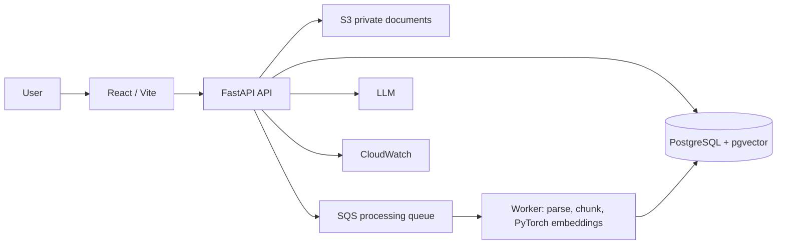

# CloudMind

CloudMind is a private AI document intelligence platform: users upload TXT/PDF files, CloudMind processes them, retrieves relevant passages with vector similarity, and returns grounded answers with sources.

> **Status:** Phases 1–3 complete: the local MVP now has an S3-backed storage implementation ready for deployment. Queue workers, RDS/pgvector, ECS, and monitoring remain later phases.

## Architecture



The local implementation uses SQLite and local in-memory storage. Set `CLOUDMIND_STORAGE_BACKEND=s3` and `CLOUDMIND_S3_BUCKET` to use `S3StorageService`; it stores private, encrypted objects as `documents/{user_id}/{document_id}/original.{extension}` and creates short-lived presigned download URLs only after ownership validation. `DocumentProcessor`, `StorageService`, `EmbeddingService`, `RetrievalService`, and `LLMService` isolate provider-specific work.

## Run locally

```bash
cd backend
python -m venv .venv && source .venv/bin/activate
pip install -r requirements.txt
uvicorn app.main:app --reload
# Separate terminal
cd frontend && npm install && npm run dev
```

Open the UI at `http://localhost:5173`; API documentation is at `http://localhost:8000/docs`.

Or run `docker compose up --build`.

## Verification

```bash
PYTHONPATH=backend pytest backend/tests
```

## Data flow and security

1. Authenticated user uploads a validated PDF/TXT document.
2. A document record is created; it is parsed, chunked, embedded under `torch.inference_mode()`, and marked `ready` (synchronously for the local MVP).
3. Every list, retrieval, search, and delete query filters by the JWT subject, preventing cross-user access.
4. Search embeds the question, scores only that user's ready chunks, and returns document/chunk citations.

Passwords are Argon2-hashed, SQLAlchemy binds query values, secrets live in environment variables, and file size/type are validated. Copy `.env.example` to `.env` and replace the JWT secret before deployment.

## Production roadmap

- **Async queue:** dispatch processing via SQS plus a DLQ to make processing retryable and idempotent.
- **Database:** migrate SQLite to PostgreSQL with Alembic; store embeddings in `vector`, add HNSW indexes, and use an ownership-scoped join for retrieval.
- **Compute/observability:** split API/worker Docker images on ECS Fargate; emit JSON correlation IDs, latency, failures, and processing duration to CloudWatch.
- **RAG quality:** use a sentence-transformer, pgvector cosine search, a provider-backed LLM with a strict context-only prompt, and optional reranking/hybrid BM25.

## Project layout

```
frontend/       React + TypeScript Vite interface
backend/app/    FastAPI, models, services, authentication
backend/tests/  API workflow test
infrastructure/ Terraform cloud starter
.github/        CI pipeline
```
